# Ubiqua design guidelines

These guidelines shall be applied on the design of any web application (mobile or fully responsive).

These guidelines are based on [Bootstrap](http://getbootstrap.com).

Layouts assume a [grid system based on 12 columns](http://getbootstrap.com/css/#grid).

## Brand colors

## Colors palette

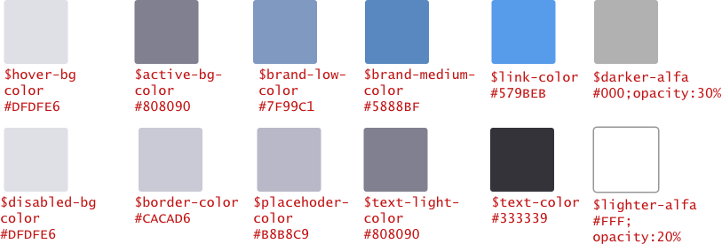

## Status colors

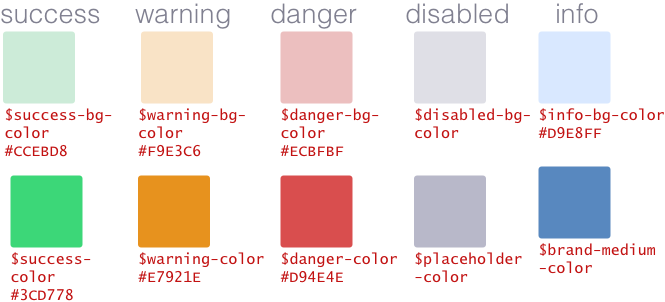

### Usage
Status colors have a special meaning and shall be used in the interface in the following way:

* __Success__: display success results or positive outcomes. Example: something was successfully saved on the database, user successfully signed up or completed a task.

* __Warning__: display a pending status or a warning about a NON BLOCKING event. Non blocking events are those do not prevent the user to continue the regular flow, but there is an special situation that may need to be taken into account.
Example: A quote is pending to be approved, then the "pending" status can be highlighted using the warning color.

* __Danger/error__: shows a blocking action or an error that does not allow the user to continue the regular flow. Additionally, it is used to activate destructive actions such as delete.

* __Disabled__: Something cannot be used, the status is finished or unavailable.

* __Info__: Informative. Provides additional information. Also used for ongoing statuses. For example: a request is on processing status.

## Paragraphs

### Specification
Default typography in all texts is `Helvetica`. The `line-height` is calculated multiplying the
`font-size x 1.42857`, therefore the default line-height is `14px x 1.42857 ~ 20px`.
Text color is `$text`.

These are the default values of texts:
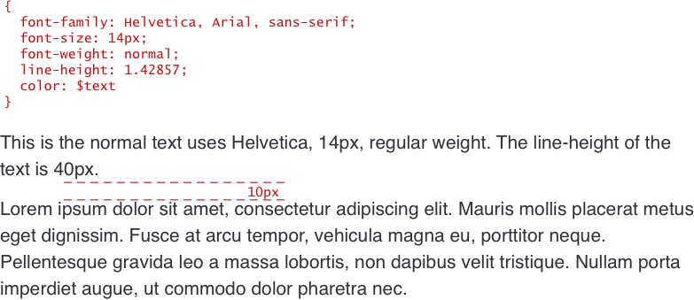

#### Variants
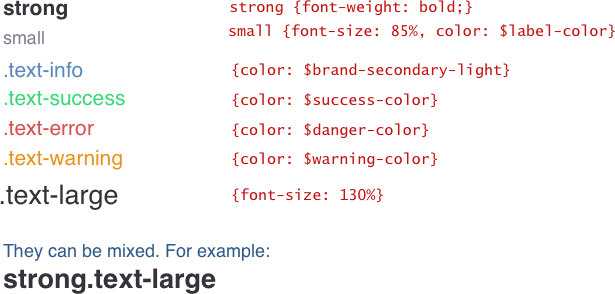

## Headers
Headers set the title for each sections within a page.

### Specification
Headers use the logo typography: `Ubuntu`.

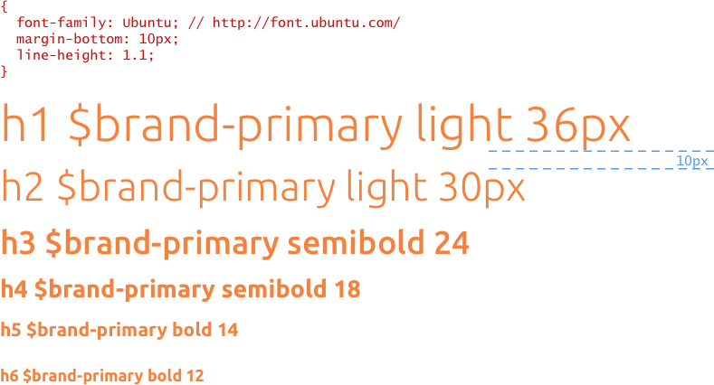

### Usage
1. Headers are used to set hierarchy of sections within a page.
2. `h1` is the highest level on the hierarchy, `h6` is the lowest.
3. If there is a subsection that belongs to a section, it's title cannot be of a higher hierarchy.
4. Generally, subsections shall have one degree of hierarchy below its parent.

For example, the section _Headers_ uses `h2`, the Specification title cannot be `h1`. It should be `h3`.

## Secondary Headers
Secondary headers set the title of a section that requires lower visual relevance.

### Specification

### Usage
Same rules described in _Headers_ apply, except one caveat, there is no `h1` in secondary headers.

## Alerts

Alerts are blocks of text that stand out from the rest of the interface.

### Specification
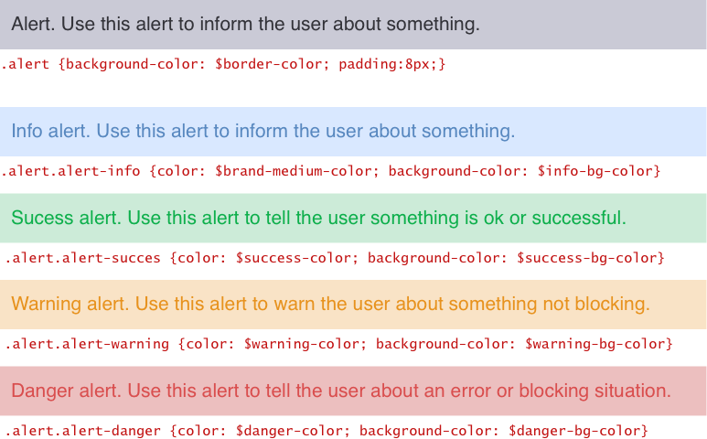

Also:

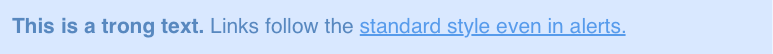

Alerts can be dismissible:

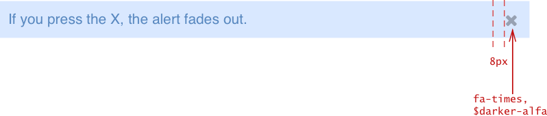

### Usage
1. Use alerts when there is an exceptional information that is important to be notified to the user.
2. Do not overuse alerts, as user will learn to ignore them.
3. Do not include more than one or two alerts on the same page at the same time.
4. Alerts are static, but they may be dismissible by the user.
5. Use the result colors guidelines to decide which type of alert display.

## Badges

### Specification
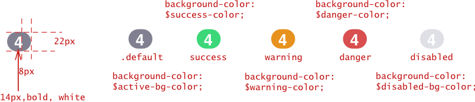

### Usage
1. Use badges to highlight a number of items or elements that require the inspection of the user or to remark a status.
2. Do not overuse the badges on a page.

## Notifications
Notifications are dismissible alerts that appear for a predefined period of time (by default 5 seconds).

There are the same types of notifications as alerts: `notification.notification-info`, `notification.notification-success`, `notification.notification-warning`, `notification.notification-danger`.

The main difference between notifications and alerts is the time the message needs visible.

### Specification
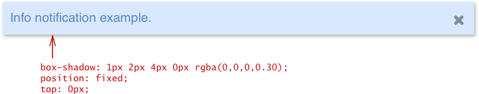

### Usage
1. As well as alerts, notifications should not be overused.
2. On desktop, notifications appear under the header + menu of the application on a fixed position.
  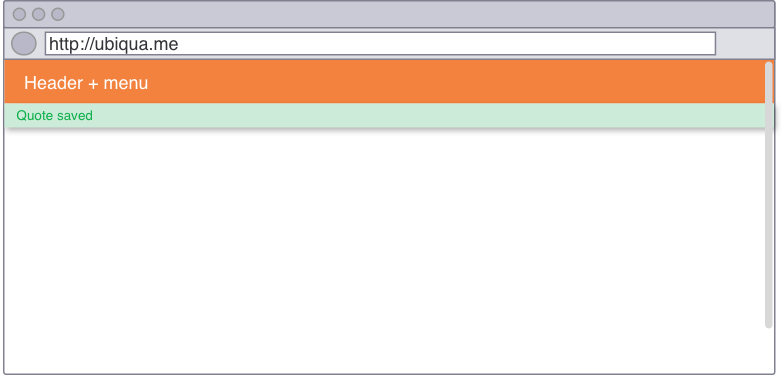

3. On mobile web applications, notifications shall appear at the top of the screen below the navigation bar. If these notifications slow down the use of the application, they may appear at the bottom of the screen on a fixed position.

    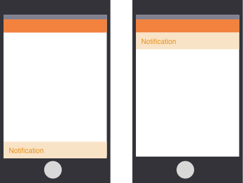

## Tooltips
Tooltips are used to provide some clarifying information to the user.

### Specification
Ubiqua tooltips follow the standard definition of bootstrap tooltips, only the `background-color` is modified.

### Usage
1. Because tooltips do not work well on touchable interfaces, do not show information the user needs to know on tooltips. Tooltips should only provide additional clarifying information nice to know (for instance: a keyboard shortcut).

2. By default tooltips appear with `:hover` effect and after a delay of 0.3 seconds.

## Popovers
Popovers provide contextualized additional information of an item.

### Specification
The arrow of the popover can be in any of the sides (top, bottom, left or right).

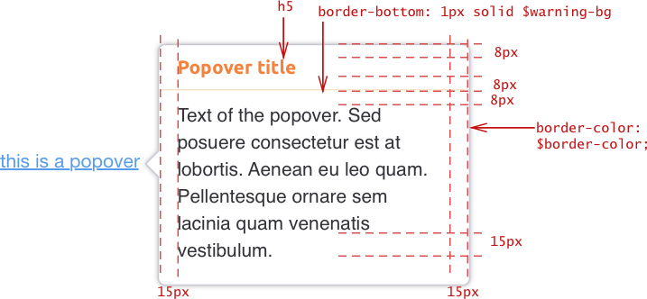

### Usage
1. Do not use complex structure or long contents on popovers.
2. Display popover only after a click.
2. By default, display the popover on the left of the item. The failover precedence is: right, bottom, left, top.

## Icons

### Specification

Ubiqua icons belong to [Font-Awesome](http://fontawesome.io).

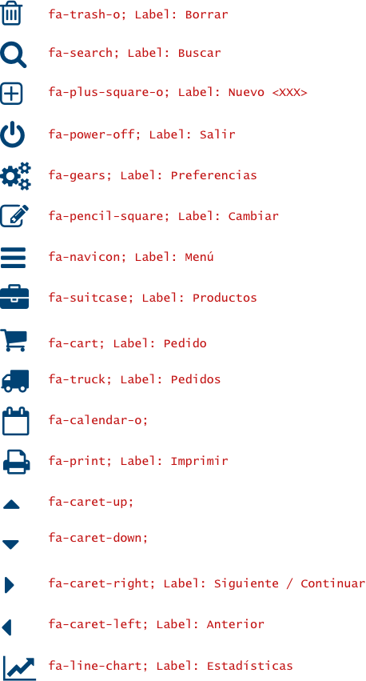

### Usage
1. Do not use labels different from the one specified above with an icon. That is, each icon has to be accompanied always with the same label.
2. Never use icons alone without a label.

#### Addition of new icons
In general, Ubiqua interfaces will use only **universal** icons. That is, those that have a familiar metaphor the user recognizes based on his previous experience.

When a new icon is added, apply the 5-second rule: if it takes you more than 5 seconds to think of an appropriate icon for something, it is unlikely that an icon can effectively communicate that meaning.

### Reference
 * [Tips for using icons in your app](https://uxplanet.org/tips-for-using-icons-in-your-app-541a6728e7d4)

## Buttons

### Specification

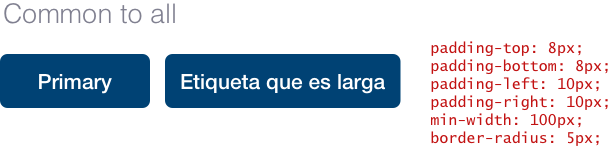

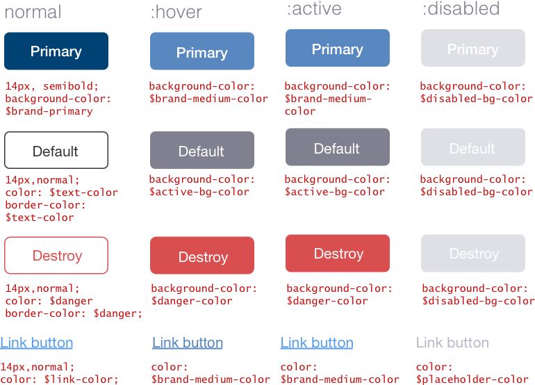

Buttons with icons:

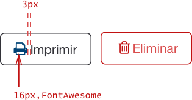

### Usage

1. Primary buttons activate the action that allows the user to continue the flow. For example, in a form, the submit button. Default buttons handle the remaining actions.
2. There can be only one primary button per form.
3. The precedence of the buttons from left to right is: from least important option to most important option.  Therefore, primary buttons appear always on the right. For example, in a typical form, there should be a Cancel button (default) on the left and a Submit button (primary) on the right.
4. Generally, is a good idea to provide a Cancel button in a form.
5. On modal windows, buttons appear at the bottom aligned to the right of the window.
6. Only use destroy buttons when removing an existing item.
7. Do not use destroy buttons for cancel actions. Use default buttons instead.
8. Buttons with icons are used only when the action is linked to that icon.
9. In general, button labels are verbs in infinitive without to. The label defines the specific action the button performs. For example:  submit, accept, update, delete, cancel, etc.
10. The more specific label the better. For example, in a form to sign up, the label of the submit primary button could be "Create account" or "Sign up".

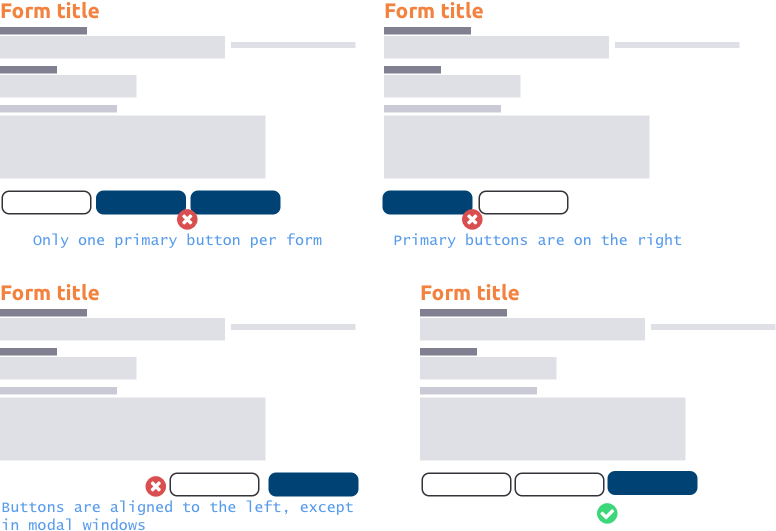

### References
  * [Primary and secondary action buttons](https://uxplanet.org/primary-secondary-action-buttons-c16df9b36150)

## Inputs

### Specification

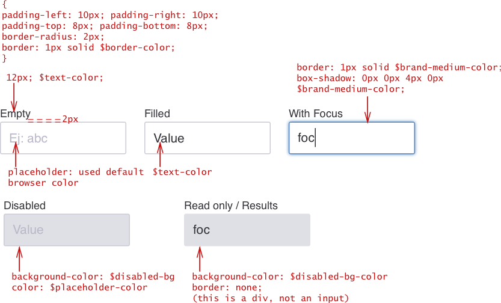

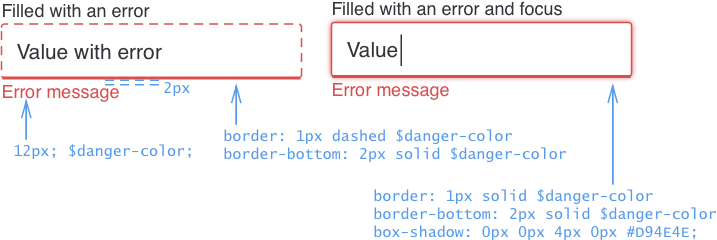

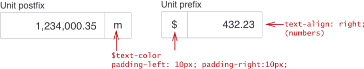

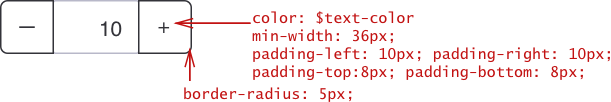

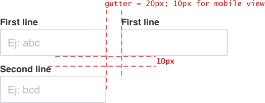

### Usage

1. Inputs size is a number of columns in the grid. Set the number of columns based on the expected length of the contents. For short contents, use a smaller input, for longer contents use a longer input.
2. In general, for all input fields, perform client side validations on blur event, that is, when the field loses the focus.
3. Align text inputs to the left and numeric inputs to the right.

    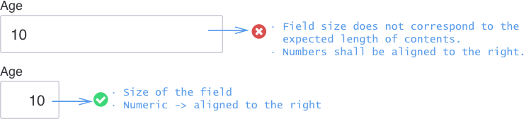

### Resources
  * [Placeholders in Form Fields Are Harmful  ](https://www.nngroup.com/articles/form-design-placeholders/)
  * [AutoNumeric plugin](https://github.com/BobKnothe/autoNumeric). Plugin for currency and numbers.

## Selects
Selects are drop down menus with a set of options.

### Specification
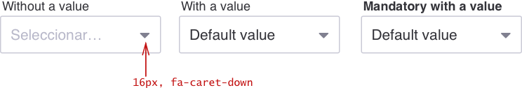

### Usage

Selects are useful because they conserve screen space and prevent users from entering erroneous data, since they only show legal choices.

1. Use selects when the number of options is between 4 and 20. For less than 4, buttons group or choice boxes may apply. For more than 20 (for example, when selecting a country) typeahead is preferred.
2. Set a default option whenever possible. If there is no default value set "Seleccionar..." ("Select...") as default.
3. Set the length of the select field accordingly to the length of its contents.

## References
 * [UX Design: Drop Downs in Forms](https://uxplanet.org/ux-design-drop-downs-in-forms-c6943ec30037)

## Typeahead
Typeahead fields allow the user to preview the results that match the query he introduced.

### Specification
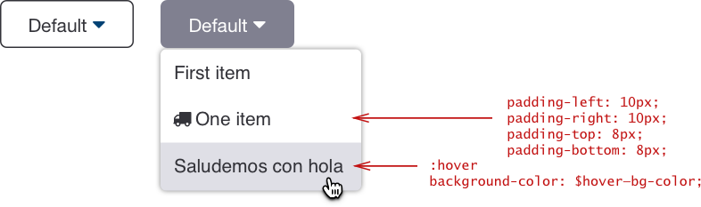

### Usage

1. Use autocomplete when the number of options is large (>20).
2. The length of the autocomplete field shall be similar to the expected length of its contents.

There are two ways to configure typeahead:

1. As advanced select. It displays all the results that match the contents of the input box. When nothing has been typed it display all the items, so the user can scroll down and scan the whole list. It works like a select.

2. As autocomplete. It displays a set of suggestions (maximum 6) that match the query entered.

## Textareas

### Specification
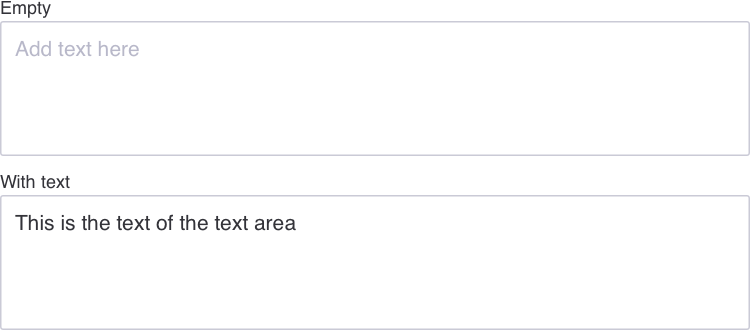

#### Textareas with counter
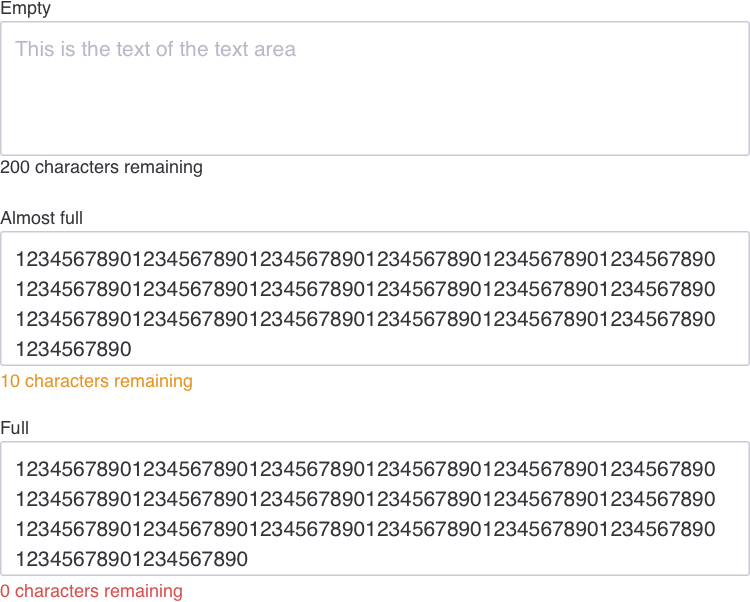

### Usage
1. The size of the text area shall correspond to the expected text length.
2. Counter shall decrease or increase on each change.
3. Change the status of the counter to warning when there are from 10 to 1 character remaining.
4. CHange the status of the counter to danger when there are no characters remaining.
3. Limit the number of characters with `maxlength` attribute.
4. Set a placehoder whenever possible.

## Dropdown menus

### Specification

### Usage
1. Use dropdown menus to group actions that are related in some logical way. For example, actions over a row in a table may be grouped in a dropdown menu.
2. The number of actions within a menu shall not be large (maximum ~6 items).
3. Avoid the need to use of scroll in a dropdown menu.

## Choices
Radio buttons are used when there is a list of two or more options that are mutually exclusive and the user must select exactly one choice

### Specification

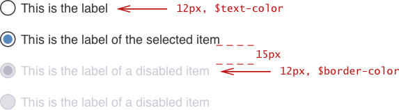

### Usage
1. Order the options logically.
2. Options shall be mutually discriminatory.
3. Set a default option whenever possible.
4. If the number of options is larger than 5, think about using a select instead.
5. Always use the choice in a vertical list.
6. The label and the circle shall be both clickable.

Choice buttons are preferred over button groups when the label is long.

### References
 * [Radio buttons UX Design](https://uxplanet.org/radio-buttons-ux-design-588e5c0a50dc)

## Checkboxes
Checkboxes are used when there are lists of options and the user may select any number of choices, including zero, one, or several.

### Specification

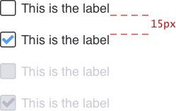

### Usage
1. By default set the most common expected status (set or unset) on the checkbox.
2. The label and the box shall be both clickable.

### References  
  * [Checkboxes vs Radio buttons](https://www.nngroup.com/articles/checkboxes-vs-radio-buttons/)

## Switches

### Specification

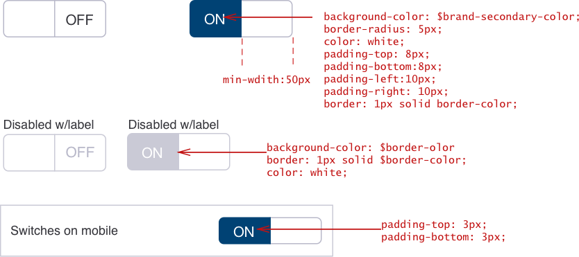

### Usage
Switches are equivalent to checkboxes in touchable interfaces. Therefore use switches when the interface is expected to be used primarily on mobile and tablets.

## Button groups

### Specification

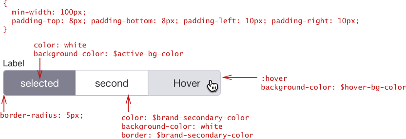

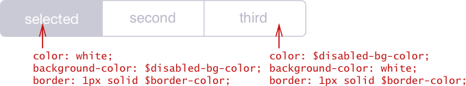

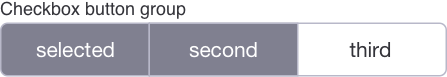

### Usage

Use button groups when the following conditions are satisfied:

1. Button labels are short. If they are long you may use a select or choice boxes.
2. The number of options is more than one and less than 4 or 5. If there is only one option, use a switch or a checkbox. If there are more than 5 options use a select or a typeahead input.
3. The number of options is not expected to grow with time. If you expect this options to growth with time, a select may be easier to maintain.

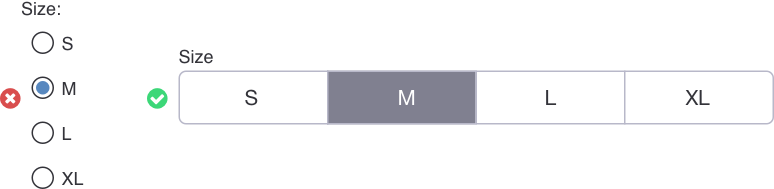

## Breadcrumbs
Breadcrumbs (or breadcrumb trail) is a secondary navigation system that shows a user’s location in a site or web app.

### Specification
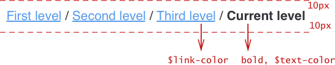

### Usage
1. Use breadcrumbs when you have a large amount of content organized in a strict linear structure or hierarchical structure with defined categories (e.g. can be partitioned into sections which can be divided into more subsections). Don't use breadcrumbs for single-level applications that have no logical hierarchy or grouping.
2. The first item of the breadcrumbs is the home page of the application.
3. Last item of the breadcrumbs is the current page. Do not add a link to this item.

### References
  * [Breadcrumbs For Web Sites: What, When and How](https://uxplanet.org/breadcrumbs-for-web-sites-what-when-and-how-9273dacf1960)
  * [Breadcrumb Navigation Increasingly Useful](https://www.nngroup.com/articles/breadcrumb-navigation-useful/)

## Tabs

### Specification

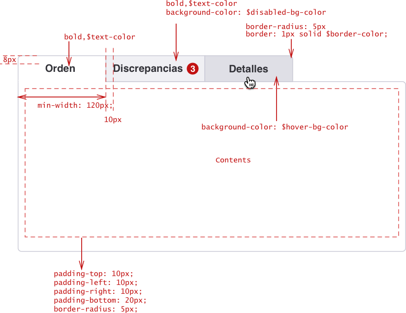

### Usage
1. Do not use more than six tabs.
2. Use short names on tabs.
3. Only one tab can be active at the same time.
4. Order tabs in a way that makes sense for the user.
5. Tabs cannot be nested.

### References
  * [Tabs, used right](https://www.nngroup.com/articles/tabs-used-right/)
  * [14 Guidelines For Web Site Tabs Usability](http://usabilitygeek.com/14-guidelines-for-web-site-tabs-usability/)
  * [Material design tabs](https://material.google.com/components/tabs.html#tabs-usage)

## Tables

### Specification

**Main table**

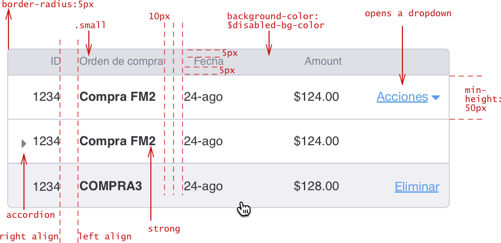

**Secondary table**
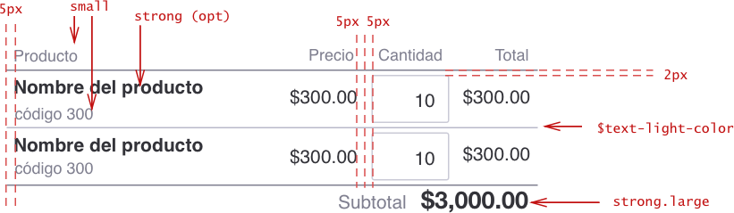

### Usage

* __Column order__

  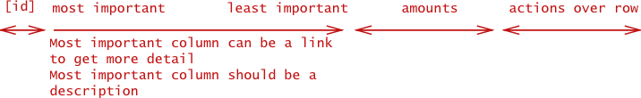

  * In general, the order of the columns goes from most important for the user on the left to least important.
  * Ids should be at the leftmost column.
  * Amounts such as price or quantity are placed on the right.
  * Related columns should be next to each others
  * Text columns are aligned to the left. Numeric columns are aligned to the right.

* __Optimization of horizontal space.__ Sometimes tables have too many columns which take more than the horizontal space available.  In those cases, to avoid horizontal scroll (specially on mobile devices) merge several cols in one. In order to do this, the data of the cols should be univocally identified. In the example below, the order number and the date have been merged with the order description. Also the status of the order was merged in one column.

  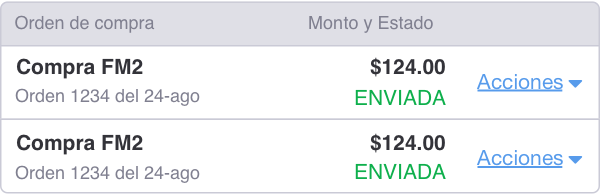

* __Headless tables__ Table head can be skipped if fields are extremely clear for the user. Using this option, the interface is much cleaner.
To be sure the data is comprehended, tooltips can be added.
  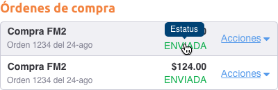

Note that some tables, specially headless tables can be implemented using `div` elements instead of using `table`. This should be taken into account specially in fully responsive designs.

## Accordions
Accordions allow the user to display additional information without losing current context.

### Specification

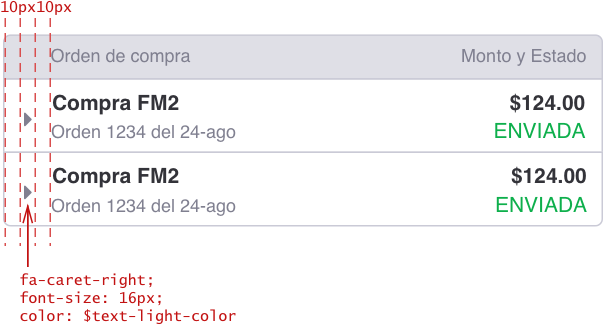

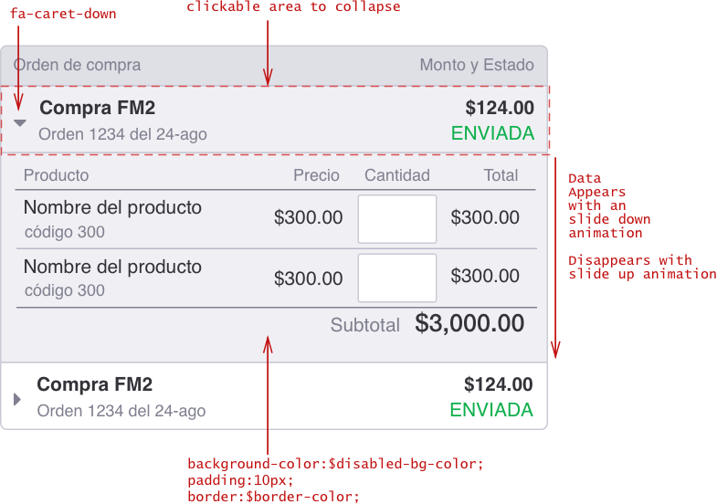

### Usage

Accordions are suitable when people need only a few key pieces of content on a single page. By hiding most of the content, users can spend their time more efficiently focused on the few topics that matter.

Accordions should be avoided when users need most or all of the content on the page to answer their questions. Better to show all page content at once when the use case supports it.

1. Content displayed after uncollapsing shall not be very long.  
2. In general, user should be able two see two or more accordions uncollapsed at the same time.

For asynchronously (AJAX) loaded data, please refer to the __Asynchronous__ section on this document.

### References
  * [Accordions for complex content](https://www.nngroup.com/articles/accordions-complex-content/)

# Mobile lists

### Specification
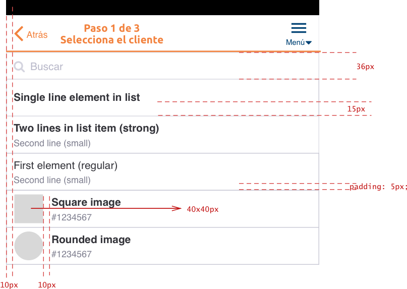
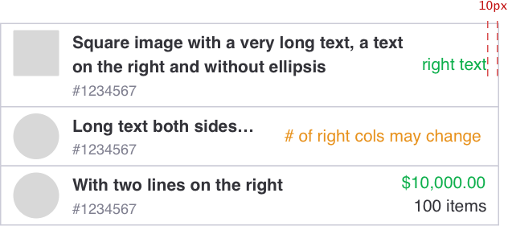
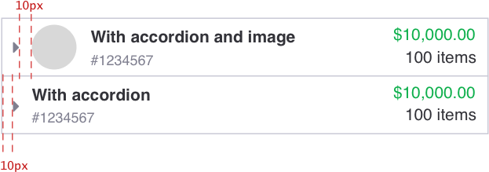

### Usage

In mobile applications it is not recommended the usage of table elements. Instead, use the mobile list.

1. Mobile list may have a search input box at the top to facilitate the search when the number of items is, in general, large (> 50).

2. Each element of the list is a link. The linkable area is the whole item. The link is displayed in a new page.

3. If there is an accordion linked to the item, the information is shown on the same page as in regular accordions.

## Modal windows

### Specification

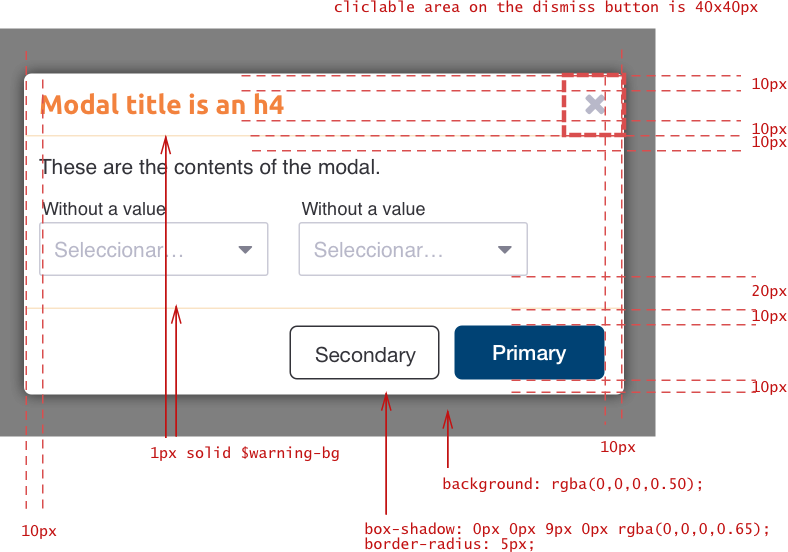

### Usage

1. Set a short but significative title. If the modal is a question do not set the question on the title.
2. Set a label with specific action performed by each button at the bottom. For example, avoid generic answers such as "Yes", "No", "Accept", "Ok" and use specific actions as "Update", "Delete", "Confirm".
  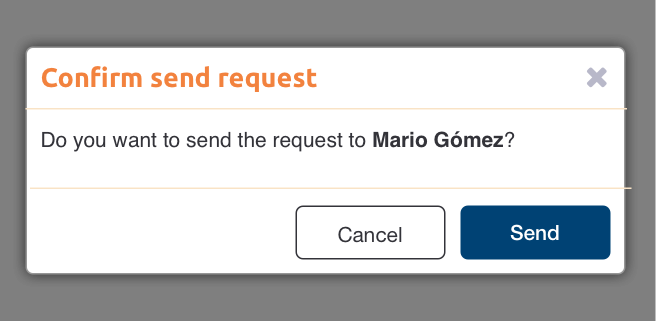

Avoid the overuse of modal windows, specially, modals are not recommended for mobile and tablet interfaces. Modal windows break the flow of the user, becoming annoying if they appear too often. Therefore they shall be used wisely.

Modal windows are a good option when:
  1. The content or the form is not large
  2. Do not want to lose current context
  3. The attention of the user us required.

### References
  * [Overuse of Overlays: How to Avoid Misusing Lightboxes](https://www.nngroup.com/articles/overuse-of-overlays/)

## Desktop header and menu

### Specification

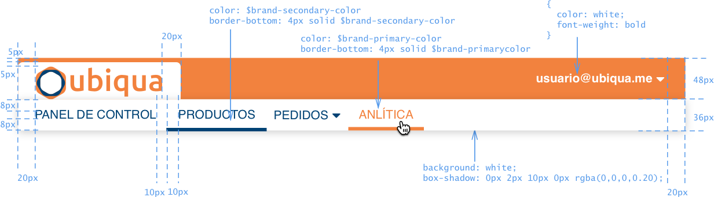

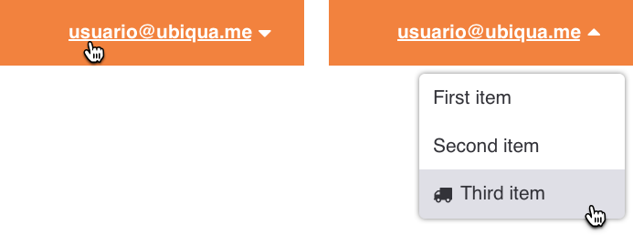

### Usage

1. The header shall be always visible (fixed position)
2. Organize dropdown options on a logical way and follow the principles defined in the Labeling section.

## Mobile header and menu

### Specification

#### Mobile Tabs
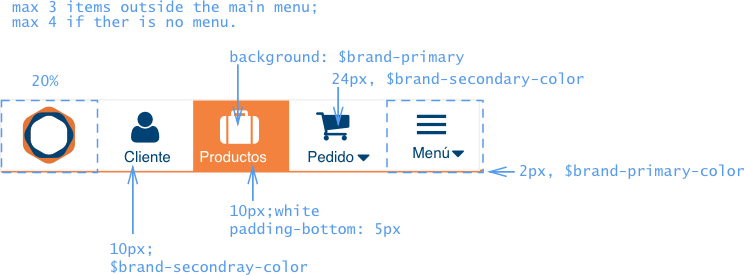

#### Navigation bar

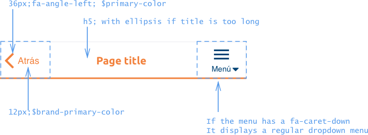

#### Static footer
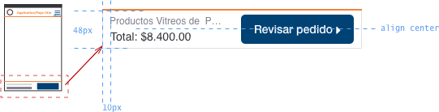

### Usage

1. Mobile header is always visible (fixed position). Static footer too.

2. Navigation bar works as a regular stack (first in, first out). When user accesses a new page, the previous page is pushed to the stack of the navigation bar. If an user goes back, that page is pulled back from that stack and displayed.

## Off-canvas menu
User can browser in a linear way using the navigation bar going back and forth using the links and the back button. However, if he needs to go to different sections of the application, we use the Off-canvas menu.
### Specification

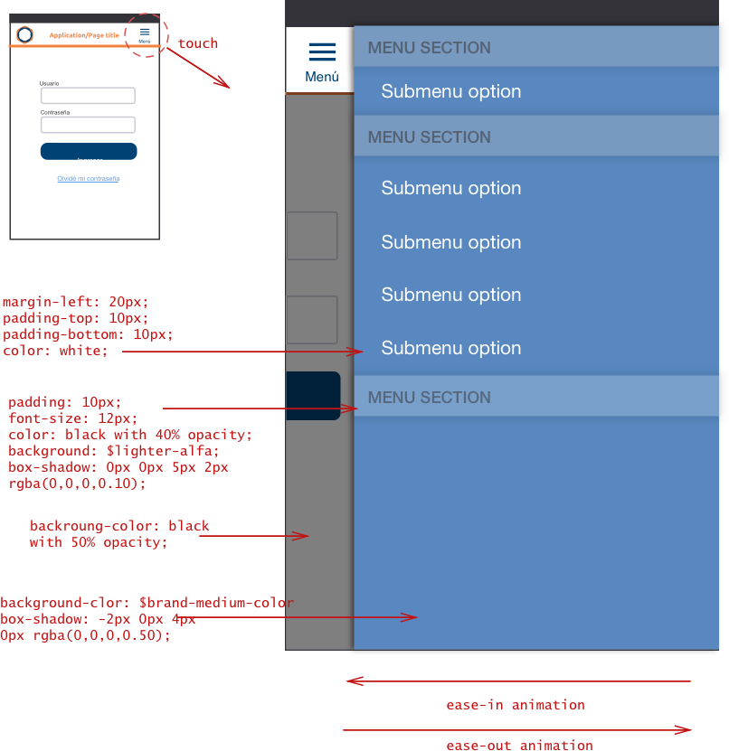

### Usage
1. Use it when there are too many options that cannot be displayed on tabs.
2. Organize the different related menu items in sections grouped logically. Use unambiguous labels in sections (see labeling recommendations).

## Form layouts

#### Regular form
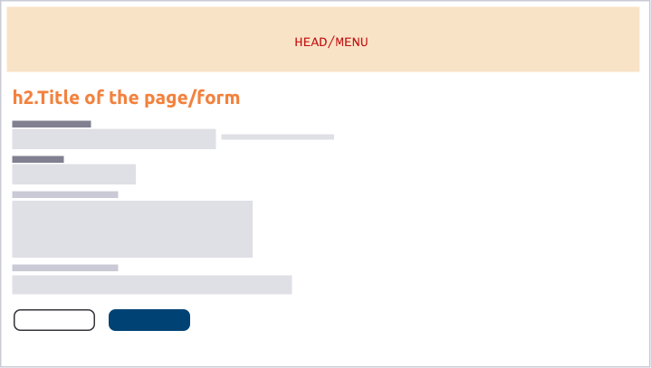

#### Search form
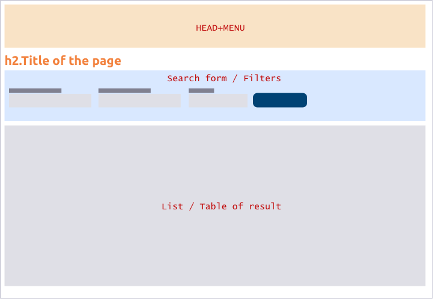

#### Calculator forms
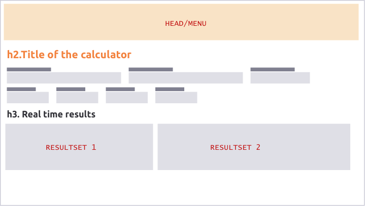

## Form design guidelines

1. Mark mandatory fields with a bold label. Optional fields is recommended to be marked adding the _'(optional)'_ text to the label.

    
2. Order fields logically and those fields related appear together. For example, contact information appears together (address, zip code, country, phone, etc.)

3. Mandatory fields shall appear at the beginning of each logical section of the form. Optional fields at the end.

    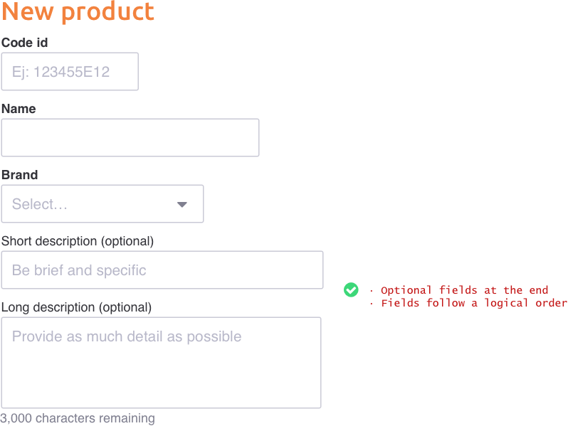

4. In long forms, use headers to separate the different logical areas.

5. In general, forms only have one field per row, so user can fill the fields sequentially.

      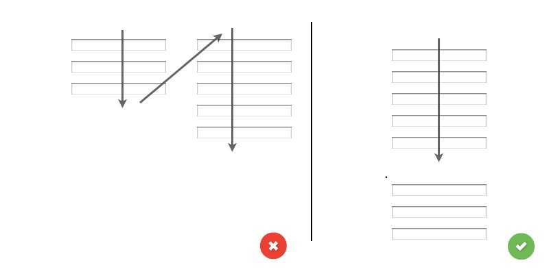

6. Several fields per row are used in applications in which results are displayed in the same page as the form such as calculators or search forms. On these cases, maximize the number of fields and information that is displayed in the screen avoiding scroll between form and results whenever possible.

7. Do not modify, show or hide fields above the current one. If a field conditions the state of another, locate this second field after the first one.

      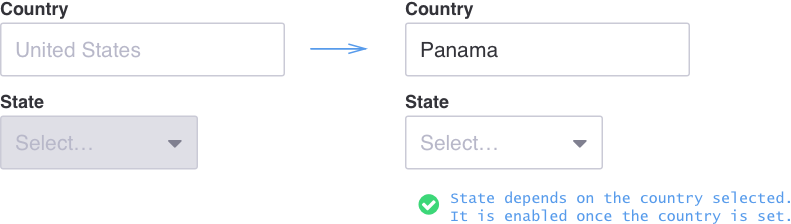

8. In a form, request only the minimum information required. If the system can infer a value do not ask for it on the form.

    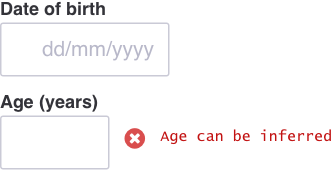

9. Hide or disable a field? Keep hidden the fields that are only required for exceptional cases. Disable fields that are displayed on the default form view, but do not apply for the current selected options.

    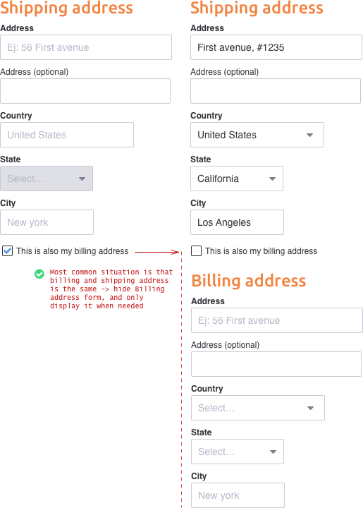

10. Provide a default value whenever possible. For example, if the majority of your users live in Panama and you request its shipping address, you can set Panama as default country and province (as ~50% of the country population lives in that province).

11. Include a placeholder with an example. For example, in a phone number you can place the expected format.

12. Prevent the user from making an error. For example, in numeric fields do not allow to type letters or symbols. If the field has a particular format such as a credit card or an id number, set a mask.

#### Example
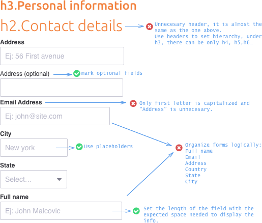

### References:
* [Designing More Efficient Forms: Assistance and Validation](https://uxplanet.org/designing-more-efficient-forms-assistance-and-validation-f26a5241199d)
* [Designing Perfect Text Field: Clarity, Accessibility and User Effort](https://uxplanet.org/designing-perfect-text-field-clarity-accessibility-and-user-effort-d03c1e26004b#.908st6zko)
* [10 Rules For Efficient Form Design](https://uxplanet.org/10-rules-for-efficient-form-design-e13dc1fb0e03)

## Labeling
Labeling refers to the texts that identify the action a button performs, the name of a field or the menus title. Selecting a good label is one of the most difficult processes of defining an interface.

1. __Labels shall be short__. Users do not like reading. For example: instead of _"Work opportunities"_ it shall be used just _"Jobs"_.
2. __Labels shall be specific__. The more specific the better. For example: In a modal window that confirm the removal of an item, instead of _"Cancel"_ and _"Accept"_ it is better to use _"Cancel"_ and _"Delete"_. As delete is more specific and indicates the user the concrete action the button performs.
3. __Labels shall be unambiguous__. For example, if the user is looking for canned beans and the sections are _"Meat"_ and _"Vegetables"_ there is no ambiguity that he will find the beans on the _"Vegetables"_ section. But if the sections are _"Processed food"_ and _"Cans"_ he may access any of them.
4. __Labels shall be consistent__. Within each application and across all the applications of Ubiqua. For example, if in an application it is used "Sign out" to leave the app, it shall not be used "Exit" or "Log out" others.
5. __Labels shall be adapted to the user language__. Avoid technical stuff and use labels a regular user would understand.
6. __Use positive sentences wording__. It's easier for the user to understand a positive sentence than a negative one. For example, avoid negations such as "Don't send me more email," which would mean that the user would have to check the box in order for something not to happen.
7. __Capitalize only the first letter of the first word__. Example: "Create user", "Zip code". Exceptions to this rule are acronyms (which should be avoided).
8. __Avoid acronyms and abreviatures__ Example: "Name and surn."

## Errors
In general, __the interface shall be designed to prevent the user to make a mistake__. For example, if in a textarea the user can only type up to 200 characters, instead of allowing the user to type any amount of characters and displaying an error when he types more that 140 characters. A good interface would limit the number of characters the user can type. Additionally, the interface could display the number of characters remaining, providing this way a better feedback of the status.

Error shall follow the same rules of labeling, they shall be short, specific, unambiguous, consistent across the interface and adapted to the user language (human readable).  Examples of bad error messages:_"An error of type 2 has occurred","Illegal command","Syntax error"_

Errors should include:

  1. an explicit indication of what went wrong
  2. and some guide to help the user to recover from the error.

Examples: _'Incorrect email, it should look like user@example.com', 'Sundays are not allowed, select another day of the week'_ or _'Out of range. Maximum is 500'_.

When the space to place the error is small, for instance, in errors shown under a field. Instead of telling the user what happened, focus on telling the user how to recover from it. For example: _'Set any day except Sunday'_, _'Maximum is 500'_.

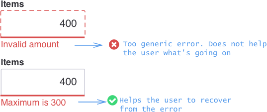

### Field validation

There are two points that validations shall be done:

1. Validation of the field after editing on blur, that is, when the field loses the focus.
2. Validation on submit, that is, when de user wants to continue to the next step.

Whereas the first validation is related with format and syntax of a field, the second validation is related with business rules, a field may be syntactically correct, but because of the status of the system cannot have that value. For example, during sign up, a user tries to create an already existing username. However, on this cases, whenever possible it is better to perform the validation also on blur. On the previous example, the system can check if the user exist via javascript on blur.

### Resources
  * [Error message guidelines](https://www.nngroup.com/articles/error-message-guidelines/)

## Full Screen asynchronous feedback

### Specification

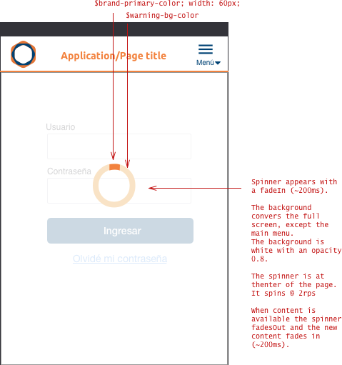

### Usage
Provide this feedback when loading or changing all the information on the screen or the action that is being performed may take a long time.

### References
  * [CSS Loaders](http://projects.lukehaas.me/css-loaders/), example of implementation.

## Data process asynchronous feedback

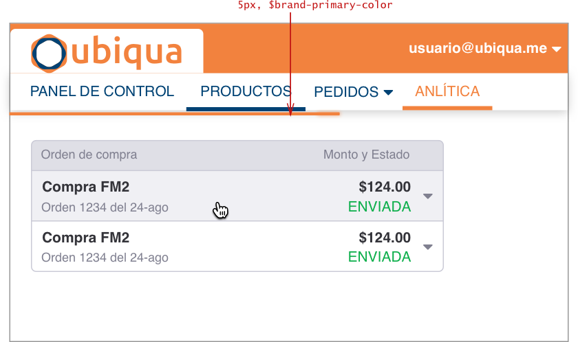

### Usage
This asynchronous feedback is displayed when some data is being loaded, saved, updated on
the current page. For example, if the data of an accordion has to be loaded from the server, this visual feedback shall be displayed.

### References
  * [Ngprogress](http://ricostacruz.com/nprogress/), an example of implementation of this feedback.

## Examples and layouts of complete pages

### Desktop login

#### Layout
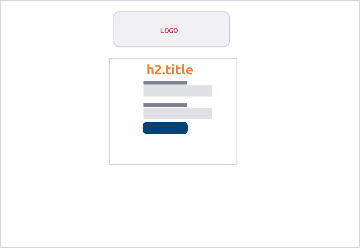

#### Example:
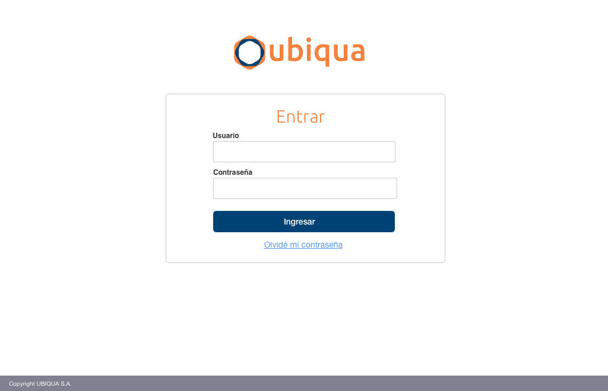

### Desktop search form

#### Layout

##### Example:
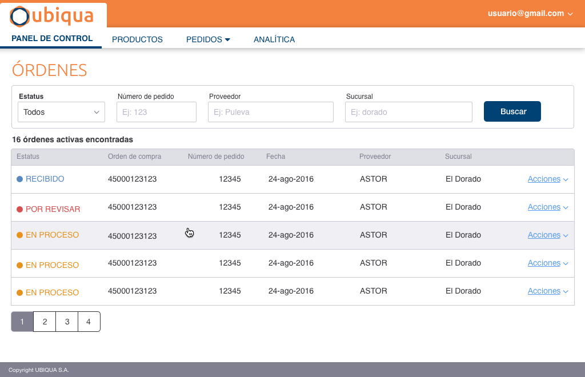

### Desktop product

#### Layout
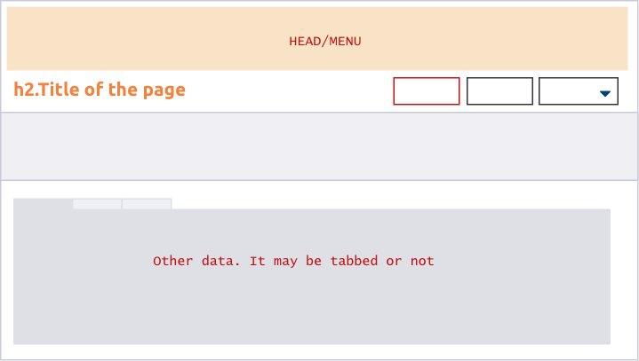
#### Example
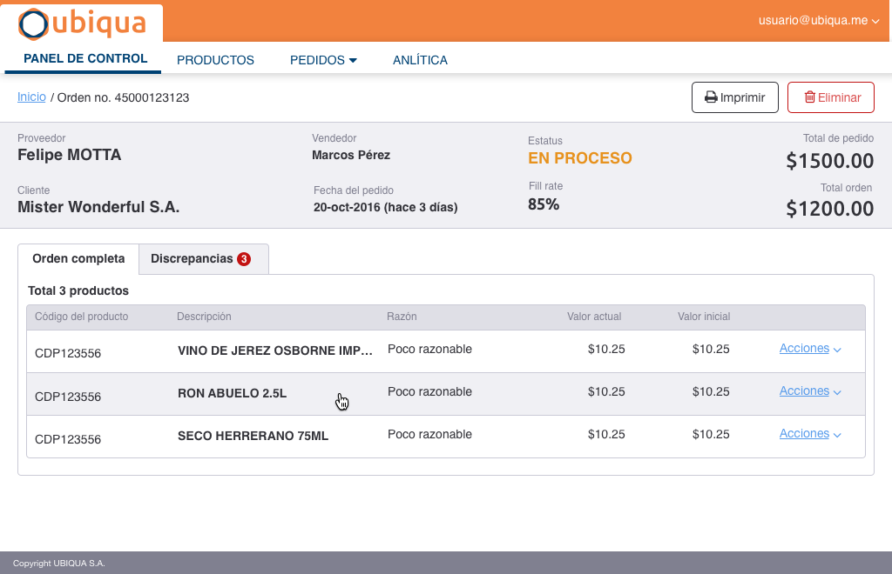

### Desktop modal window
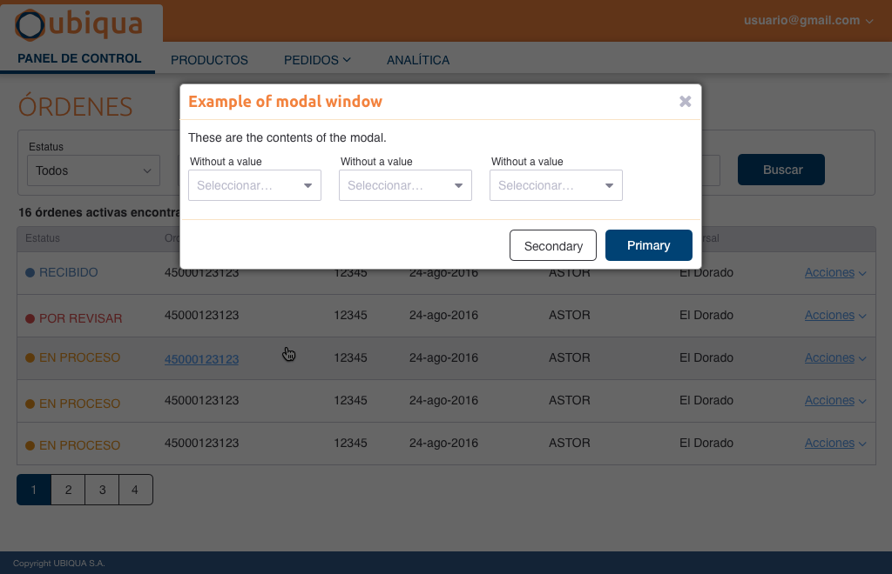

### Mobile login
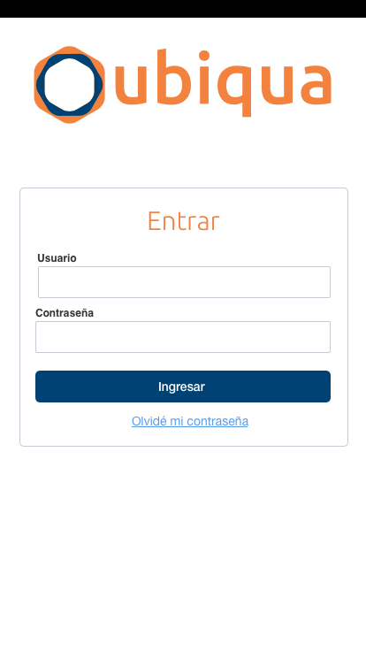

### Mobile product list
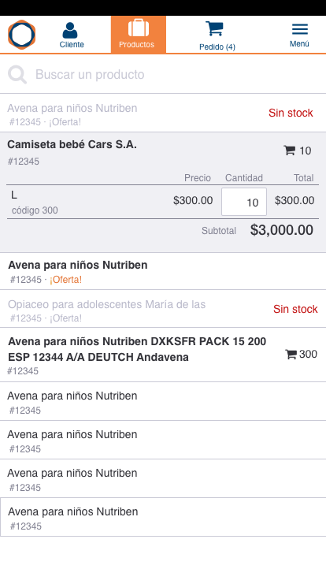

### Mobile flow
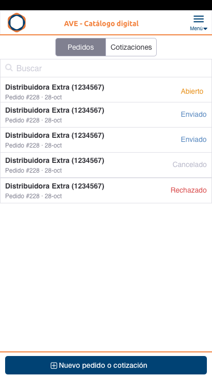
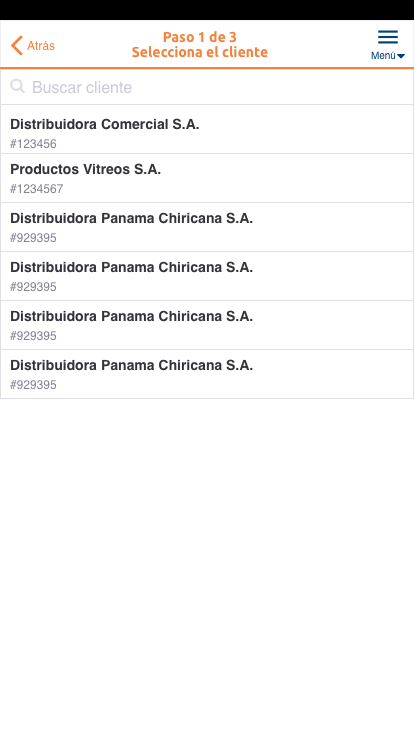
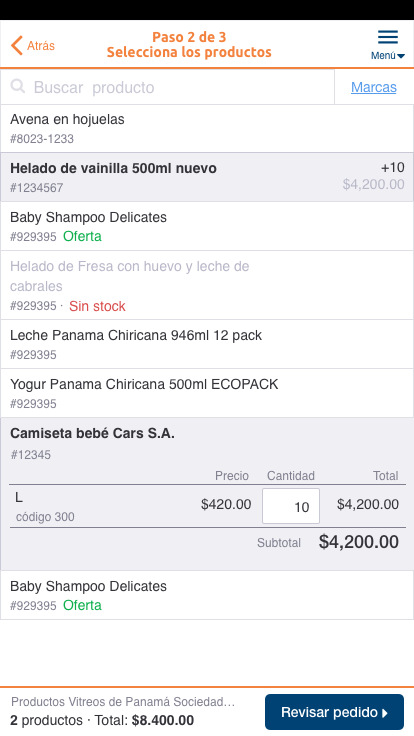
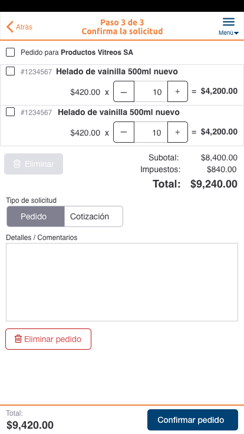
